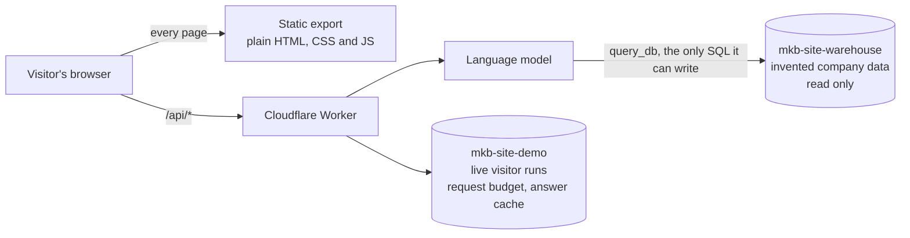

<div align="center">


<a href="https://markkennethbadilla.com"></a>
<a href="https://markkennethbadilla.com/resume/"></a>

</div>

<br/>

## The short version

Most portfolios describe work. This one runs it.

There are four live things here. A site guide you can ask questions in plain English, and three exhibition rooms that hit a real database when you press the button. Nothing is a video, nothing is a screenshot, none of them run on arrival, and every room states what it does **not** prove before you start it.

> *"A demo that says only what it proves invites the reader to assume the rest."*

---

## How a page reaches the database

The site itself is a folder of plain files. One Cloudflare Worker sits in front of `/api/*` and nothing else, so there is no server runtime, no framework adapter and no hosting bill.

There are two databases rather than one, and that is the most important line in this README.



The ScoreAudit room hands a language model a real SQL tool. With one database, a single model-authored `SELECT` stood between one visitor and every other visitor's live run, and the only thing in the way was a list of banned table names. Ten hostile statements were tried against that list and all ten got through.

A name-matching check can always be written around. Two databases cannot, because a Cloudflare D1 binding reaches one database and nothing else. The tables the model must never see are not in the database the model can reach. There is no rule to bypass, because there is no rule.

---

## The site guide

Ask it something in free text. It picks the section of the page that answers you, the page eases there, that section lights up, and a small entity perches beside it and speaks. One model round trip.

Underneath there is a cascade that escalates only when the first model returns no usable tool call, a similarity cache so a rephrased question never reaches a model at all, a Zod enum allowlist so an invented destination cannot be chosen, and a grounding check that discards any claim the fact corpus does not license.

Every answer prints what actually happened. Model or cache hit, latency, grounding verdict, tools called. Not behind a toggle.

`Tool-calling loop` `Model cascade` `Lexical cache` `Structured output` `Grounding check`

[`worker/guide.ts`](worker/guide.ts) &nbsp;·&nbsp; [`src/lib/grounding.ts`](src/lib/grounding.ts)

---

## The three rooms

| Room | What you press | What it proves | What it does not prove |
| --- | --- | --- | --- |
| **[Ledger Under Fire](https://markkennethbadilla.com/demos/ledger-under-fire/)** | Twelve payments fired at one account at the same instant, first on the unsafe path and then the safe one | A read-then-write gap loses real money under real concurrency, and one conditional `UPDATE` that carries its own precondition closes it | That the safe path holds at a real company's size. A dozen requests against a free database is not a payments system under load |
| **[ScoreAudit](https://markkennethbadilla.com/demos/score-audit/)** | Six questions with checkable answers, asked once with a SQL tool in reach and once without | The distance between a confidence a model states and an answer a query can check, measured by something that never sees the model's own number | That the model is dishonest. Six questions is an illustration, not a rate |
| **[Split-Brain Sandbox](https://markkennethbadilla.com/demos/split-brain/)** | Three nodes racing for one lease, then the leader cut off from the store and let back in | A stale fencing token is refused at the storage layer, so a node that was asleep cannot act on a claim it no longer holds | That this survives a real network partition. Real network failures are messier in ways that matter |

Three terms carry those rooms, so here they are once.

- **Read-then-write race**, two requests read the same balance before either one writes, so the second quietly overwrites the first.
- **Lease**, a timed claim on a job that expires unless its holder keeps renewing it, so a node that goes silent loses it automatically.
- **Fencing token**, a counter that rises by one every time the lease changes hands. The database refuses any write carrying an old number.

### What is staged, stated plainly

The company, the customers, the invoices and the warehouse are invented. Two of the three rooms inject their failure on purpose and say so in the same words they declared it with.

Split-Brain unplugs nothing. Cutting a node off sets a flag on that node's own row, which its own code checks before it talks to the store. ScoreAudit rigs nothing at all. The only difference between its two runs is that one of them withholds the query tool.

ScoreAudit's one recorded run scored 6 of 6 at 100 percent stated confidence with the tool and 0 of 6 at 2 percent without it. Well calibrated in both directions, which is a truer and more interesting result than the one the copy originally promised, so the copy changed.

[`worker/demos/ledger-under-fire.ts`](worker/demos/ledger-under-fire.ts) &nbsp;·&nbsp; [`worker/demos/score-audit.ts`](worker/demos/score-audit.ts) &nbsp;·&nbsp; [`worker/demos/split-brain.ts`](worker/demos/split-brain.ts)

---

## The stack

<div align="center">

**Bedrock** &nbsp;·&nbsp; Language and runtime


**Canopy** &nbsp;·&nbsp; Interface


**Mycelium** &nbsp;·&nbsp; AI


**Watershed** &nbsp;·&nbsp; Edge


</div>

---

## The gates

Every check below exists because of a specific way this site could quietly become a lie. They run under `node --test`, with no framework and no fixtures.

**[`tests/guide.test.mjs`](tests/guide.test.mjs)** proves the agent cannot invent a biography. It runs the grounding check against the exact fabrications free models produced before it existed, a university he never attended and an employer he never worked for, and against the subtler kind a real corpus makes possible, where the number is real but attached to the wrong noun. It also asserts every destination the model can choose actually renders on the page, that no fact or page string names an employer internal, and that every figure a fact states is a figure that fact licenses.

**[`tests/demos.test.mjs`](tests/demos.test.mjs)** proves the rooms cannot overclaim. Every room fills in all three wall-label lines and keeps each one under 32 words, the "what is real" line has to name the **layer** the behaviour happens at, a room with an injected failure has to disclose that injection in the words it declared it with, no promise may count an outcome before the run that produces it, every source link has to resolve, and `reserve()` may appear in exactly one file so a new room cannot forget to charge the request budget.

**[`tests/probe-demos.mjs`](tests/probe-demos.mjs)** is the one that matters most, and it needs a real Worker. It asserts the unsafe ledger path **actually loses money** under a genuine concurrent fan-out. Correct-looking code that simply never races would pass every static check above and prove nothing.

```bash
bun run check         # types, lint, the static gates, the Worker unit tests
bun run check:full    # the above, plus Playwright and every outbound link
bun run probe:demos   # against a running `wrangler dev --remote`
```

---

## Running it

```bash
bun install
bun run dev                                  # site only, /api/* needs the Worker

bun run build && npx wrangler dev --remote   # the whole thing, against the real databases
```

`--remote` is not optional. The demos read seeded data that only exists in the remote databases, and a local empty one lets every assertion pass vacuously.

Credentials are never in the repo. `node scripts/cf.mjs <wrangler args>` injects them from the local vault and writes nothing to disk.

---

<div align="center">

<sub>The company, the customers and the invoices in the demos are invented. The concurrency, the queries and the model calls are not.</sub>

<br/>

<sub>Interface forked from <a href="https://github.com/dillionverma/portfolio">dillionverma/portfolio</a> (MIT). The agent, the demos, the Worker and the gates are mine.</sub>

<br/><br/>

<a href="mailto:markkennethbadilla@gmail.com">
  
</a>

<br/>


</div>
